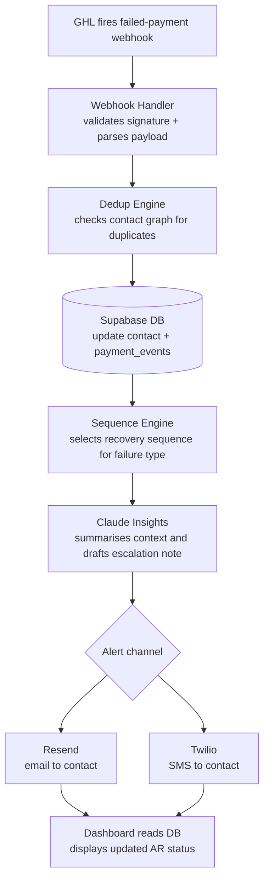

# Architecture

## Overview

revenue-recovery-kit is a three-tier web application backed by a Supabase-managed Postgres database and integrated with Go High Level via webhooks and a polling adapter. The system is designed to run locally via Docker Compose with a single `docker compose up -d` and to deploy to any container platform that can reach a Supabase project. The API layer drives all business logic; the frontend is a pure read/display layer that consumes the API.

## System Diagram

```
┌─────────────────────────────────────────────────────────────────┐
│  External                                                        │
│                                                                  │
│  ┌──────────────┐   ┌─────────┐   ┌────────┐   ┌────────────┐  │
│  │  Go High     │   │ Resend  │   │ Twilio │   │ Anthropic  │  │
│  │  Level (GHL) │   │ (email) │   │ (SMS)  │   │ Claude API │  │
│  └──────┬───────┘   └────▲────┘   └───▲────┘   └─────▲──────┘  │
│         │ webhooks        │ alerts     │ alerts        │ prompts  │
└─────────┼────────────────┼────────────┼───────────────┼─────────┘
          │                │            │               │
┌─────────▼────────────────┼────────────┼───────────────┼─────────┐
│  API (FastAPI :8000)     │            │               │          │
│                          │            │               │          │
│  ┌──────────────┐  ┌─────┴──────┐  ┌─┴────────────┐  │          │
│  │ Webhook      │  │  Resend    │  │  Twilio      │  │          │
│  │ Handler      │  │  Adapter   │  │  Adapter     │  │          │
│  └──────┬───────┘  └────────────┘  └──────────────┘  │          │
│         │                                              │          │
│  ┌──────▼───────┐  ┌────────────┐  ┌──────────────┐  │          │
│  │  Dedup       │  │  Sequence  │  │  Claude      ◄──┘          │
│  │  Engine      │  │  Engine    │  │  Insights    │             │
│  └──────┬───────┘  └─────▲──────┘  └──────┬───────┘             │
│         │                │                 │                      │
└─────────┼────────────────┼─────────────────┼──────────────────────┘
          │                │                 │
┌─────────▼────────────────┴─────────────────▼──────────────────────┐
│  Supabase (Postgres 16 + Auth + RLS)                               │
│  contacts │ invoices │ payment_events │ sequences │ insights        │
└────────────────────────────────────────────────────────────────────┘
          ▲
┌─────────┴──────────────────────────────────────────────────────────┐
│  Frontend (Next.js 14 :3000)                                        │
│  AR dashboard │ recovery sequences │ contact health │ insights      │
└────────────────────────────────────────────────────────────────────┘
```

## Data Flow: GHL Failed-Payment Webhook

This is the critical path that directly drives revenue recovery.



## Components

### Webhook Handler

Receives inbound HTTP POST requests from GHL. Validates the `X-GHL-Signature` header against `GHL_WEBHOOK_SECRET`, parses the JSON body into a Pydantic model, and dispatches to the appropriate domain handler (contact events, invoice events, payment events). Implemented in `backend/app/`.

### Dedup Engine

Given a contact payload from GHL, queries the contacts table for existing records with matching email, phone, or name+company. Merges duplicates according to a configurable strategy (keep-most-recent by default). Ensures downstream sequences operate on a single canonical contact record.

### Sequence Engine

Drives the recovery timeline for overdue invoices and failed recurring charges. Sequences are stored as rows in the `sequences` table with a step index and a scheduled-at timestamp. A background worker (Celery or APScheduler — decided on Day 2) polls for due steps and executes them by calling the Resend or Twilio adapters.

### Claude Insights

Calls the Anthropic API (Claude Sonnet) with a structured prompt containing a contact's payment history, sequence state, and any available context notes. Returns a short prose summary and a recommended next action. Results are stored in the `insights` table and surfaced on the dashboard. API key is `ANTHROPIC_API_KEY`.

### Resend Adapter

Wraps the Resend HTTP API for transactional email. Used by the Sequence Engine to send recovery emails at each sequence step. Configured via `RESEND_API_KEY`.

### Twilio Adapter

Wraps the Twilio REST API for SMS. Used by the Sequence Engine for high-urgency escalation steps. Configured via `TWILIO_ACCOUNT_SID`, `TWILIO_AUTH_TOKEN`, and `TWILIO_FROM_NUMBER`.

### Supabase (Database + Auth)

Postgres 16 managed by Supabase. Row-Level Security is enabled on all tables so that multi-tenant deployments can be introduced without a schema rewrite. Supabase Auth handles JWT issuance for the frontend. Configured via `SUPABASE_URL`, `SUPABASE_ANON_KEY`, `SUPABASE_SERVICE_ROLE_KEY`, and `DATABASE_URL`.

### Frontend (Next.js 14)

App Router-based dashboard. Reads data from the FastAPI backend via `NEXT_PUBLIC_API_URL`. Uses Tremor for chart and stat-card components and TailwindCSS for layout. No server-side business logic — all data mutations go through the API.

### n8n Integration Adapter

For operators who prefer a visual workflow layer, `integrations/n8n/` contains exported n8n workflow JSON that mirrors the core sequences. This is an optional adapter; the Python backend is authoritative.

## Environment Variables

All environment variables are documented in `.env.example` at the repo root. Copy `.env.example` to `.env` and populate the values before running `docker compose up -d`. Variables prefixed with `NEXT_PUBLIC_` are embedded into the Next.js bundle at build time and must not contain secrets.
